# Introduction

I created this project while I was a trainee at the KAU cyber center, this program is built using python and I have used three APIs, Virustotal API, urlscan.io API and OPEN AI API.

In this project I have many libraries, mainly I used Customtkinter for the GUI, I also used PyInstaller to convert My python file into an runable .exe file, PyPDF2 to read the pdf files, cv2 to read the Qr code, openai to utlize chatgpt, And lastly I have used json and requests to send and handle the requests from the APIs.

The main functionality of the program is to scan URLs for possible threats, using Urlscan.io and Virus total Api, and display the results of the scan for the user, and then scan all the redirects and all of the links in the page, also the program will display all of the individual scan results from the 90 websites that Virus total uses and then will display a screenshot of the scanned URL. The user can choose either to type in the URL or to use an image with a qr code as the URL.

Another feature is the chatbot, which uses the OpenAI Api (ChatGPT), using the chatbot you can ask any question related to the policies and guidelines of the Cyber security center based on the provided pdf files and cannot answer any unrelated questions. In order to create this feature, I used [this project](https://github.com/alejandro-ao/ask-multiple-pdfs.git) to learn how to create a chat with pdf feature, and heres a discription of how it works.

> The application follows these steps to provide responses to your questions:
>
> > - PDF Loading: The app reads multiple PDF documents and extracts their text content.\n
> > - Text Chunking: The extracted text is divided into smaller chunks that can be processed effectively.
> > - Language Model: The application utilizes a language model to generate vector representations (embeddings) of the text chunks.
> > - Similarity Matching: When you ask a question, the app compares it with the text chunks and identifies the most semantically similar ones.
> > - Response Generation: The selected chunks are passed to the language model, which generates a response based on the relevant content of the PDFs.

This reposotiery contians:

- /Code : which contains the code.
- /Images : which contains the images used in this README file.
- /pdfs : the folder to store the pdfs in.
- UrlScanner.exe : the .exe file of the project, in other words the actual project

# Initial setup

The only required setup is to have a folder called ‘pdfs’ in the same folder the program (UrlScanner.exe) is placed in. in this folder you will keep all the policies and guidelines pdf files so that the program is able to read the files and answer users questions. You must make sure the folder is named ‘pdfs’ all in small letters.

# Interface Preview

When the users start the program they will be greeted with the main tab, the URL tab. In this tab the user can type the URL to be scanned.

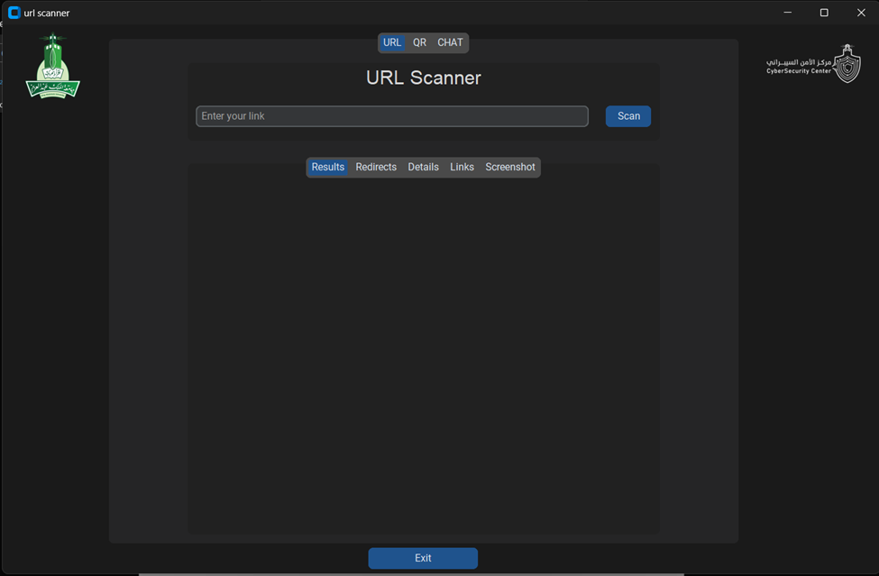

The second tab is the QR tab, in this tab the user can select an image to scan the QR code in it and extract the URL and then scan it.

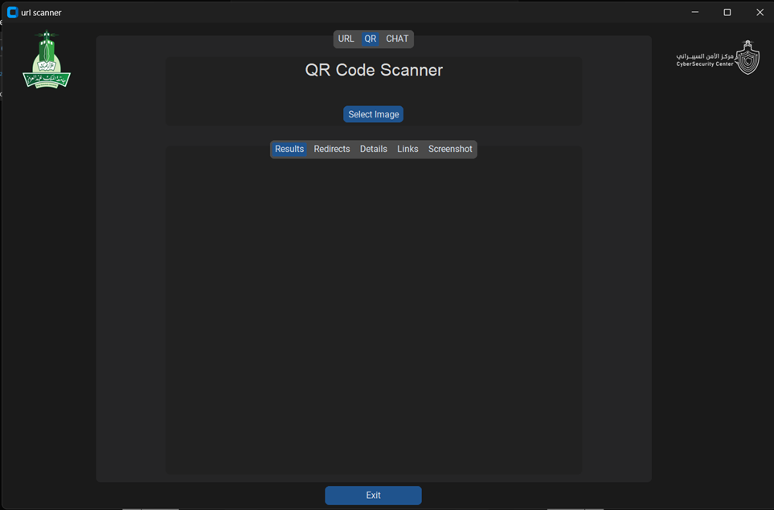

The third tab is the chat tab, in this tab the user can use the chatbot to ask any questions about the polices and guidelines of the cyber security center.

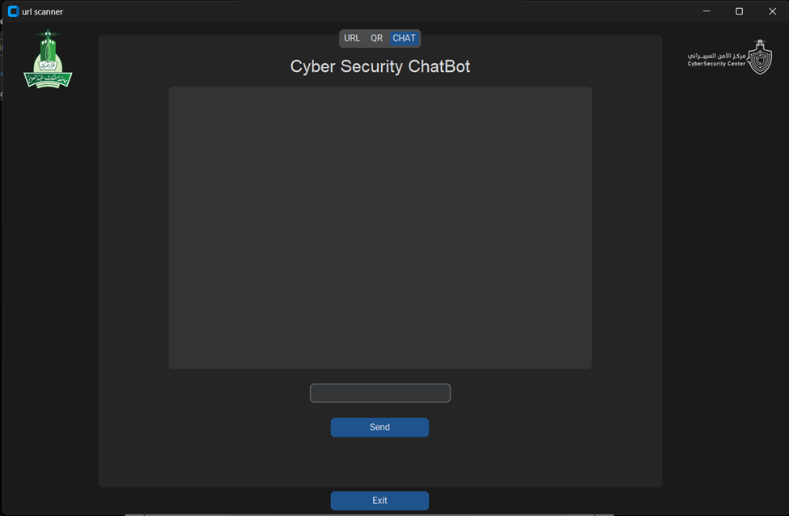

# Functionality and features

In the URL and QR tab, the user can scan a URL and all of its redirects. then the user can press the button to scan all of the links in the page. The results will be displayed in the results tab.

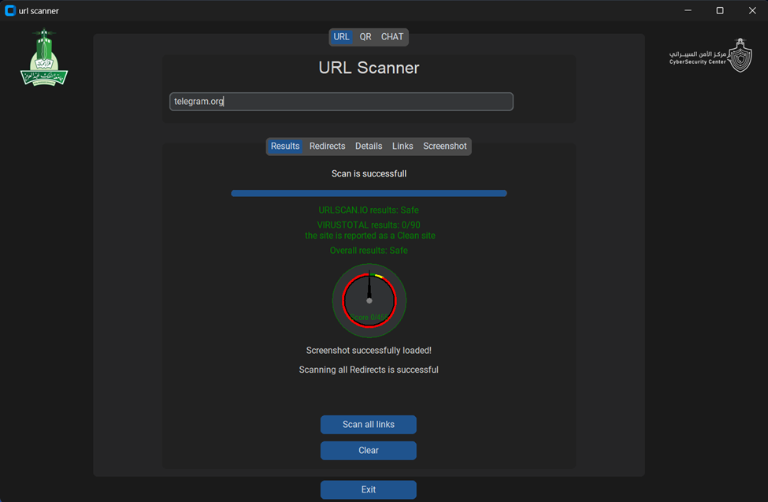

The URL and QR tab has four additional tabs, redirects, details, links and screenshot. The redirects tab will display all of the redirects and the results of scanning them.

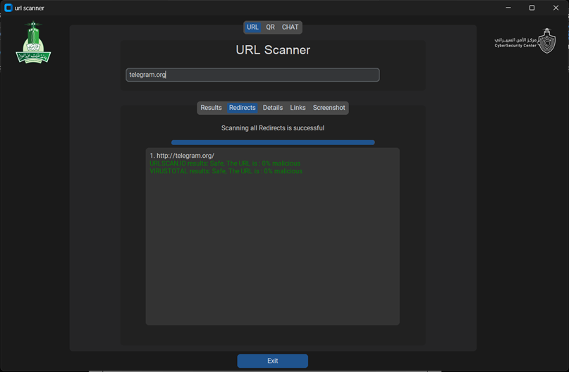

In the details tab, the user can view all of the 90 websites of the virus total scan.

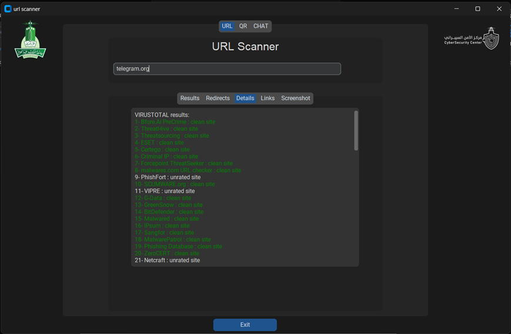

In the links tab the user can view all of the links in the page.

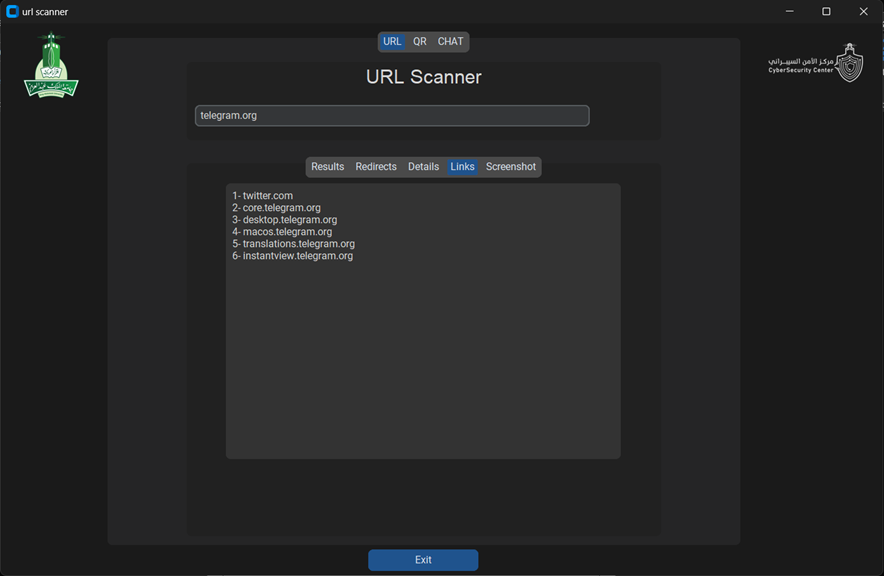

If the user selected to scan all of the links in the page, the results well be displayed in the links tab.

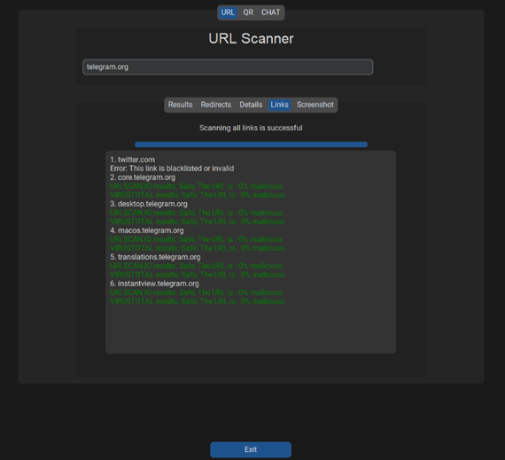

In the Screenshot tab, the screen shot will be displayed with the button to open the screenshot externally.

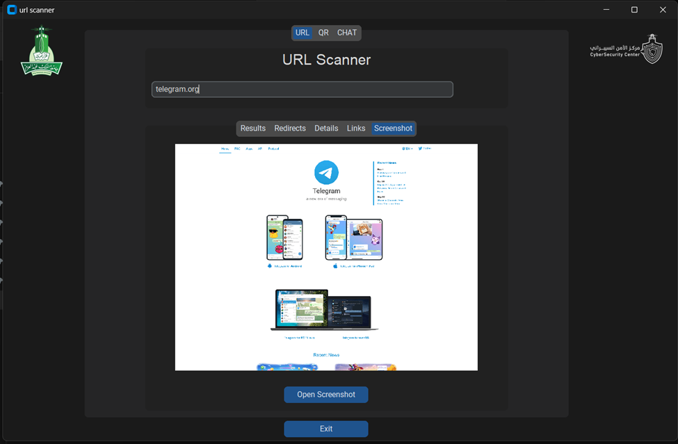

In the Chat tab, the users can ask the chatbot questions and gets answers.

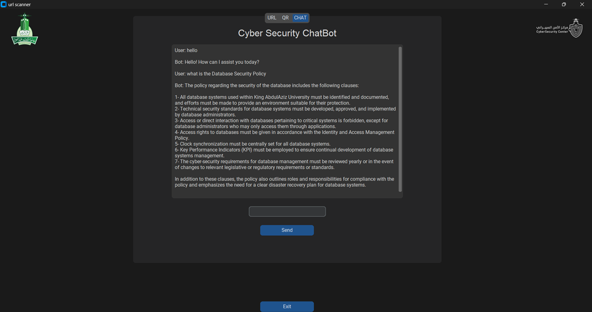

# Possible Errors

NOTE: the program will always take a couple of minutes to start, this NOT a problem with the program, it is just slow. So please wait until the program is fully loaded before using it.

- A common problem is that when a scan is attempted the program might display the message “Scan was Unsuccessful” that is mainly due to the Rate limitations of the APIs we are using. If you face this message, close the program for a couple of minutes and try again later.

- in the Chat tab the send button will not appear if the pdfs folder was not found, to fix this problem make sure the pdfs folder exists and is in the same folder as the program. And make sure it has the pdf files to read.

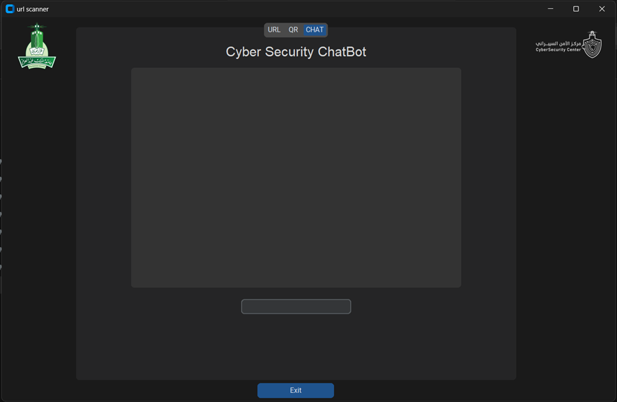

- Another error is when there is no internet connection or the urlscan.io and virus total websites are blocked, to fix this problem try connecting to another internet network e.g., Use your mobile hotspot.

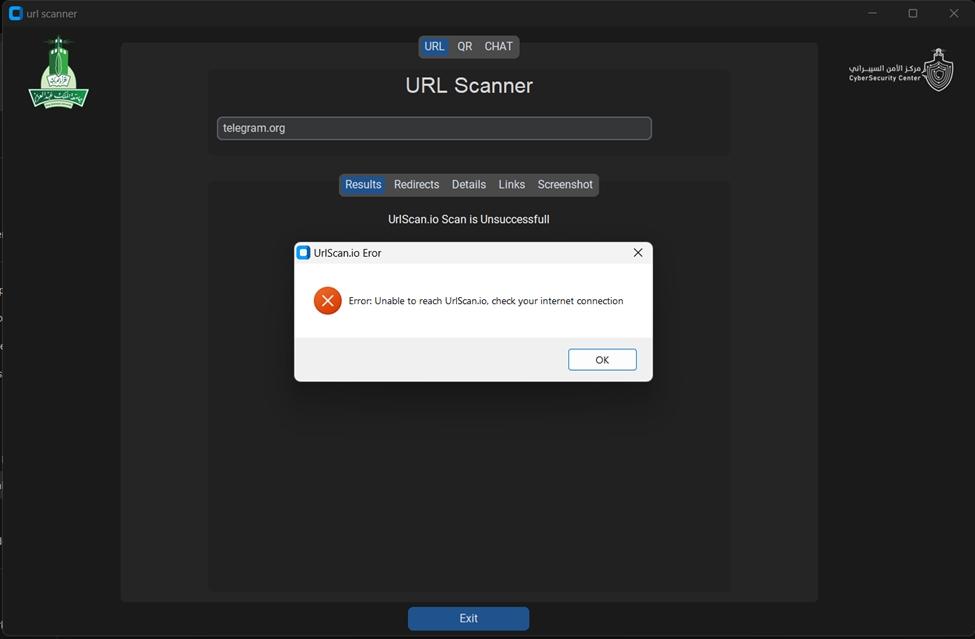
